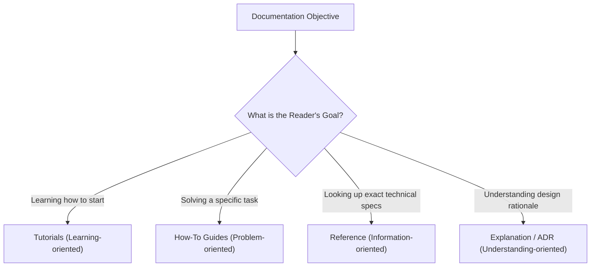

# Documentation Standards & Diátaxis Framework (v3)

The **Documentation Standards** skill governs how technical specifications, architectural decision records (ADRs), guides, and reference documents are authored in Wiz-Blitz v3.

---

## 1. Diátaxis Documentation Quadrants

1. **Tutorials (Learning-Oriented)**: Guided, step-by-step onboarding (e.g. "Getting Started with clean-web").
2. **How-To Guides (Problem-Oriented)**: Focused recipe addressing an exact real-world problem (e.g. "How to add an MCP Server to blitz.yaml").
3. **Reference (Information-Oriented)**: Exact, unambiguous technical descriptions (e.g. CLI flags, API endpoints, schema definitions).
4. **Explanation / ADR (Understanding-Oriented)**: Design rationale, architectural trade-offs, and context (e.g. `local/arch-v3.md`).

---

## 2. Core Documentation Invariants

1. **Repo-Relative Links Only**: Never use absolute local machine links (`file:///Users/...`) in committed documentation. Always use repository-relative paths (`./` or `../`).
2. **Quoted Mermaid Labels**: In Mermaid diagrams, always quote label texts containing brackets, parentheses, or colons (`id["Label (Details)"]`) to avoid rendering syntax errors.
3. **Zero Content Fluff**: Be concise, actionable, and structured. Prefer bullet points, code blocks, and diagrams over long prose.
4. **Standard Markdown & Tables**: Use GitHub Flavored Markdown (GFM) tables and alert callouts (`> [!NOTE]`, `> [!IMPORTANT]`, `> [!TIP]`, `> [!WARNING]`).
