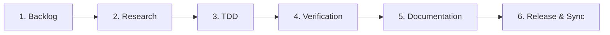

# 6-Phase Engineering Lifecycle (Wiz-Blitz v3)

---

## Phase 1: Backlog & Task Inception
- **Objective:** Capture requirements deterministically before writing code.
- **Actions:**
  - Create task in local SQLite ledger via `./bin/blitz backlog add "<title>"` or MCP tool `backlog_create_task`.
  - Exactly ONE task in `in_progress` status at any time.
  - Set priority, stage (`backlog`), and acceptance criteria.
  - Sync markdown ledger via `./bin/blitz sync`.

---

## Phase 2: Research & Architectural Alignment
- **Objective:** Define interfaces, evaluate trade-offs, and eliminate context pollution.
- **Actions:**
  - Search workspace or schema using `./bin/blitz index search <query>` or `mcp-wiz` tools.
  - Review relevant skills and micro-fragments in `config/fragments/`.
  - For non-trivial designs, document architectural decisions in an ADR (`docs/adr/` or `local/arch-*.md`).
  - Advance task stage to `research`.

---

## Phase 3: Test-Driven Development (TDD)
- **Objective:** Build deterministic assertions before production implementation.
- **Actions:**
  - Write table-driven Go tests (`pkg/*/*_test.go`) or Vitest specs (`tests/*.test.ts`).
  - Verify that tests initially fail or exercise uncovered code paths.
  - Enforce zero-CGo dependencies (`modernc.org/sqlite`).
  - Advance task stage to `tdd`.

---

## Phase 4: Implementation & Verification
- **Objective:** Deliver clean, modular, strictly typed code and pass all checks.
- **Actions:**
  - Implement minimum viable functionality satisfying the tests.
  - Run package tests: `go test -v ./pkg/...` or full test suite: `go test -v ./...`.
  - Verify zero lint/compilation errors.
  - Advance task stage to `verification`.

---

## Phase 5: Documentation & Session Memory
- **Objective:** Keep developer and AI agent context in continuous synchronization.
- **Actions:**
  - Document public functions, structs, and interfaces.
  - Update `local/SESSION_MEMORY.md` with completed deliverables, current commit, and next steps.
  - Advance task stage to `documentation`.
  - Synchronize SQLite ledger to markdown: `./bin/blitz sync`.

---

## Phase 6: Release & Binary Recompilation
- **Objective:** Finalize, compile standalone binaries, and commit atomically.
- **Actions:**
  - Recompile standalone binaries to `bin/`:
    `go build -o bin/blitz ./cmd/blitz`
    `go build -o bin/mcp-<name> ./cmd/mcp-<name>`
  - Verify binary readiness via `./bin/blitz plugins`.
  - Mark task as `completed` with stage `release` in backlog.
  - Commit changes adhering to Conventional Commits:
    `git commit -m "<type>(<scope>): 
"`
