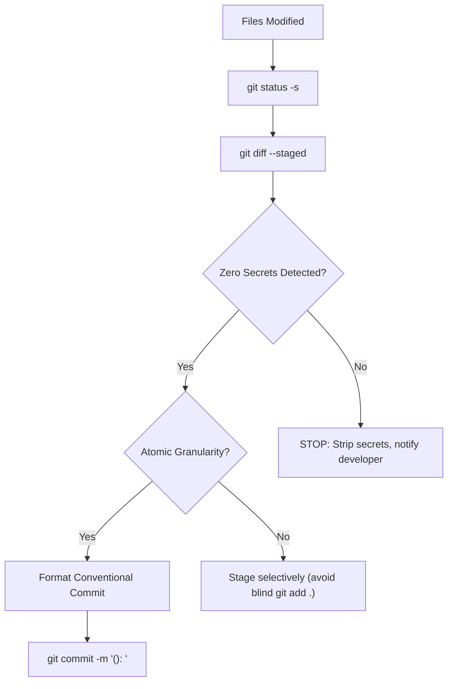

# Git Workflow & Safety Rules (v3)

The **Git Manager** skill enforces safe, atomic, and structured version control across all Wiz-Blitz v3 repositories.

---

## 1. Commit Workflow

---

## 2. Conventional Commit Standards

All commits must follow the specification:
`<type>(<scope>): <description>`

### Common Types:
- `feat`: A new feature, tool, or MCP capability
- `fix`: A bug fix
- `refactor`: Code change that neither fixes a bug nor adds a feature
- `test`: Adding missing tests or correcting existing tests
- `docs`: Documentation-only changes
- `chore`: Maintenance tasks, dependencies, tooling updates

---

## 3. Strict Safety Guardrails

1. **NEVER** modify `.git/config` or global Git configurations.
2. **NEVER** run destructive commands (`git reset --hard`, `git push --force`) without explicit human confirmation.
3. **NEVER** bypass Git pre-commit hooks using `--no-verify`.
4. **NEVER** stage or commit secrets, private keys, API tokens (`.env`, `*.pem`, `*.key`, `token*`).
5. **NEVER** commit temporary SQLite WAL files (`*.sqlite-wal`, `*.sqlite-shm`).
