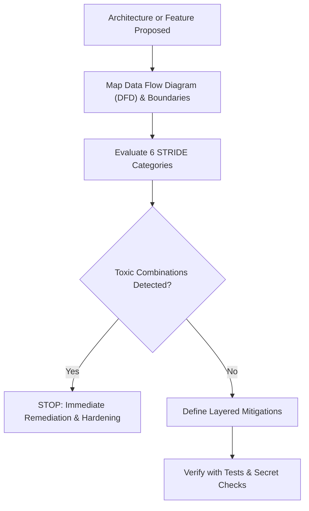

# Threat Modeling & Security Posture Analysis (STRIDE v3)

The **Threat Modeling** skill provides architectural threat analysis, attack surface profiling, and mitigation evaluation across cloud, edge, and containerized architectures.

---

## 1. Threat Modeling Decision Flow

---

## 2. The STRIDE Taxonomy

| Threat Category | Security Property Violated | Definition & Typical Vector | Core Mitigation |
| :--- | :--- | :--- | :--- |
| **S**poofing | Authenticity | Impersonating an identity, client, or server (e.g. unauthenticated API endpoints, forged JWTs). | Mutual TLS, strong API token verification, Cloudflare Turnstile. |
| **T**ampering | Integrity | Modifying data in transit or at rest (e.g. SQL injection, man-in-the-middle). | Parameterized queries (`modernc.org/sqlite`), HTTPS enforcement, HSTS. |
| **R**epudiation | Non-repudiation | Performing an action without traceable audit logs. | Structured append-only audit logging, signed transactions. |
| **I**nformation Disclosure | Confidentiality | Leaking secrets, credentials, or customer data (e.g. exposed origin IP, missing CSP). | Cloudflare orange-cloud proxy, strict secret hygiene, CSP headers. |
| **D**enial of Service | Availability | Exhausting CPU, memory, bandwidth, or database connections. | Cloudflare WAF rate limiting, timeout bounds (`time.Second`), pagination. |
| **E**levation of Privilege | Authorization | Standard user escalating to administrative role or executing unverified MCP commands. | Principle of least privilege, strict tool execution validation. |

---

## 3. Toxic Combinations Invariant

A **Toxic Combination** is a confluence of individually manageable conditions that collectively form an exploitable critical risk:
- **Example 1**: Unproxied Origin IP (`A` record direct) + Known Web Exploit = Instant DDoS / Origin Takeover.
- **Example 2**: Dangling CNAME (`*.github.io` / `*.s3.amazonaws.com`) + Unclaimed bucket/repo = Full Subdomain Hijacking.
- **Example 3**: Permissive SPF (`+all`) + No DMARC (`p=none` or missing) = Zero-friction domain email spoofing & phishing.

Always treat toxic combinations as **BLOCKERS** before release.
