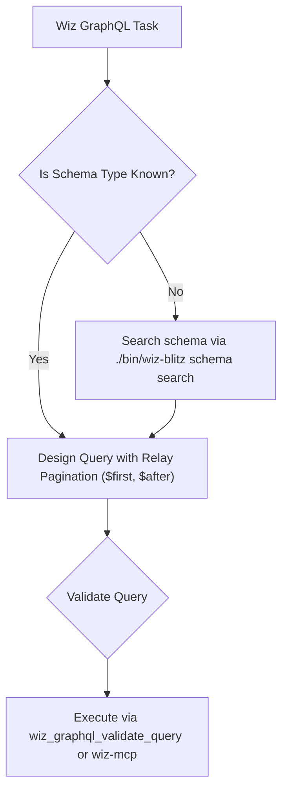

# Wiz GraphQL Query & Schema Engineering

## 0. Model Selection & Hyperparameters
- **Recommended Model:** `gemini-3.8-flash` (`flash`) for sub-second query synthesis and schema search.
- **Thinking Mode:** Disabled or low (`1,024` tokens max) for immediate operational responses.
- **Temperature:** `0.0` (strictly deterministic GraphQL syntax, zero hallucination).

> [!NOTE]
> For canonical query structures and schema CLI commands, see [Query Patterns](references/query-patterns.md).

---

## 1. GraphQL Query Decision Tree



---

## 2. Core GraphQL Invariants

1. **Relay Cursor Pagination:** Always include `$first: Int, $after: String` and request `pageInfo { hasNextPage endCursor }`.
2. **Variable Injection:** Never concatenate strings into queries. Always use typed GraphQL variables (`$filterBy`, `$first`).
3. **FTS5 Schema Search:** Always search schema types and fields using `wiz_graphql_search` or `./bin/wiz-blitz schema search` rather than grepping raw schema files.

---

## 3. Verification & Validation Checklist

Always verify GraphQL queries and schema types before production use:

```bash
# 1. Search GraphQL types and fields
./bin/wiz-blitz schema search "<type-name>"

# 2. Inspect full type definition
./bin/wiz-blitz schema show "<type-name>"

# 3. Validate query syntax against schema
./bin/wiz-blitz schema validate "query { ... }"
```

---

Created with ❤️ by Maik Ellerbrock - Advanced Service Delivery Team ⓒ Wiz
