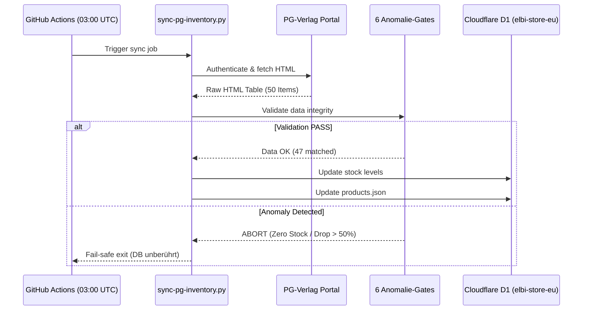

# PG-Verlag Inventar-Synchronisation & Anomalie-Gates

Um den Onlineshop `elbi.de` stets mit den tatsächlichen Lagerbeständen des PG-Verlags zu synchronisieren, läuft ein automatisierter Cron-Job.

---

## Architektur & Ablauf

## Die 6 Fail-Safe Validierungs-Gates

1. **HTML-Struktur-Check:** Prüft Tabelle und Portal-Kennung.
2. **Mindestartikelanzahl:** Mindestens 40 Artikel müssen extrahiert werden (erwartet: 50).
3. **Anker-SKU-Check:** Kernartikel (`H10`, `H12`, `H2`, `H3`, `H4`, `H5`, `S88`) müssen existieren.
4. **Katalog-Trefferquote:** Mindestens 90% der Shop-Artikel müssen eindeutig gematcht werden.
5. **Zero-Stock-Blackout-Schutz:** Meldet das Portal >20% der Artikel plötzlich als 0, bricht der Sync ab.
6. **Massiver Bestandsabfall-Schutz:** Fällt der Gesamtbestand über Nacht um >50%, wird das Schreiben verweigert.
