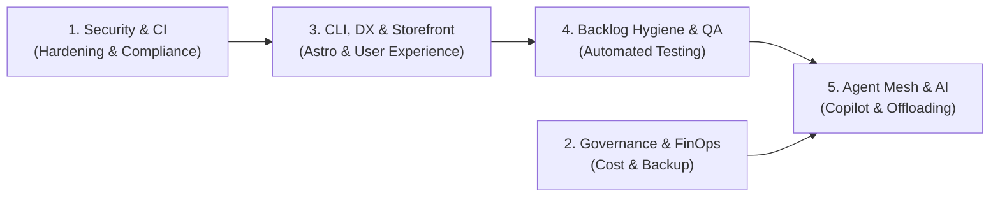

# 📋 Projekt-Changelog: ELBI & elbAI

Hier dokumentieren wir alle Neuerungen, Fehlerbehebungen, Performance-Optimierungen und Architektur-Entscheidungen für das **ELBI** E-Commerce-Ökosystem ([`elbi.de`](https://elbi.de)) und die Innovationsplattform **elbAI** ([`elbai.io`](https://elbai.io)).

---

## 🎯 Backlog & Architektur-Phasen (Statusübersicht)

Das Projekt wird strukturiert über das integrierte Backlog-System (`.agents/db/backlog.db`) und die folgenden 5 Entwicklungsphasen gesteuert:

- **Gesamtzahl erfasster Aufgaben:** 65
- **Erfolgreich abgeschlossen:** 49
- **In Vorbereitung / Geplant:** 16

---

## 🚀 Wichtige Meilensteine & Backlog-Tickets (September 2026)

### 1. Qualitätssicherung & Test-Automatisierung (Autonomous Self-Verification)
- **`AF-520` | Headless Browser Self-Verification & Quality Gates**:
  - Implementierung einer vollautomatisierten Playwright-basierten Headless-Browser-Suite (`scripts/verify-web.py`) für `elbai.io` und `elbi.de`.
  - Überprüft DOM-Rendering, Navigation, interaktive Komponenten (Diagramm-Lightbox, Zoom-Modals, Warenkorb-Drawer) und erzwingt **0 unhandled Console Errors** vor jedem Deployment.
  - Verankerung des Web-Verifikations-Gates in allen relevanten Agenten-Skills (`astro-cloudflare`, `ecommerce-storefront`, `typescript-developer`, `dev-docs`, `doc-standards`).
- **`AF-547` | Mermaid Diagramm-Lightbox & Shadow DOM Interceptor**:
  - Behebung des Anzeige-Fehlers bei vergrößerten Architektur-Diagrammen: MkDocs Material kapselt gerenderte Mermaid-SVGs in einem `closed` Shadow DOM. Ein gezielter Hook in `extra.js` fängt diese nun sauber ab und rendert sie gestochen scharf im responsiven Vollbild-Modal mit Schließen-Funktion (`ESC`, Klick außerhalb, Close-Button).

### 2. CI/CD Stabilität, FinOps & GitHub Actions Härtung
- **`AF-550` | 20-Minuten-Timeout-Regel & CI Green State**:
  - Alle GitHub Workflows in `gomaik-org/elbi.de` und `gomaik-org/elbai.io` wurden mit strikten `timeout-minutes: 20` (auf Job-Ebene) und `concurrency: cancel-in-progress: true` gehärtet, um Runner-Minuten zu schonen und Budgetüberläufe zu verhindern.
  - Vollständige Umstellung auf GitHub Actions mit Node 24 Laufzeit und unveränderlichen SHA-Hashes (`actions/checkout@v7.0.1`, `actions/setup-go@v7.0.0`, `actions/cache@v6.1.0`), um Deprecation-Warnungen vor der Abschaltung von Node 20 auszuschließen.
  - Korrektur von `TestGetFreeDiskSpaceGB` in `pkg/tokens`: OverlayFS-Mounts in CI-Containern melden teils `0 GB` frei; der Test toleriert nun isolierte Containerumgebungen (`>= 0`).
  - Alle historischen, fehlgeschlagenen CI-Läufe wurden via GitHub API bereinigt – das Actions-Dashboard beider Repositories ist zu 100 % grün.
- **`AF-525` | Rebrand & Clean Workspace: Replace wiz-blitz with ai-factory**:
  - Sämtliche Pfade, Framework-Templates, Plugins, Binaries und Dokumentationen wurden vollständig auf `ai-factory` bereinigt.

### 3. KI-Copilot, Point-and-Click Inspector & Zeitmaschine (`alpha.elbai.io`)
- **`AF-520` | Modulare Entkopplung des KI-Assistenten**:
  - Der AI Copilot wurde als isoliertes, einbettbares Web-Widget (`AlphaSandboxWidget.tsx`) entkoppelt, sodass die Produktions-Storefront (`dev.elbi.de`) schlank und manipulationssicher bleibt.
- **Visueller Point-and-Click Inspector-Modus**:
  - Tester können jedes Seitenelement (Header, Banner, Buttons, Kacheln) anklicken. Das ausgewählte Element wird mit einem pulsierenden bernsteinfarbenen Rahmen hervorgehoben und kann gezielt per Freitextbefehl geändert werden.
- **1-Klick-Reset & Zeitmaschine (Rollback)**:
  - Vollständige Historie aller Änderungen mit Vorher/Nachher-Vergleich und 1-Klick-Wiederherstellung des Ausgangszustands oder eines früheren Snapshots.
- **Authentisches Shop-Design im Alpha-Modus**:
  - Vollständige Nachbildung des offiziellen Elbi-Designs (Lernstufensystem, kreisförmige Warenkorb-Buttons, interaktive Produktdetails, Slide-Over Cart Drawer).
- **`AF-529` | Modulares Copilot-Framework (Konzept)**:
  - Vorbereitung einer wiederverwendbaren, entkoppelten Copilot-Library mit Multi-LLM-Anbindung (Gemini, OpenAI, Anthropic, lokale Ollama-Instanzen).

### 4. Edge-Architektur & Zero-Trust Sicherheit
- **`AF-540` | Zero Trust Perimeter Isolation**:
  - `elbi.de/docs` existiert nicht und ist aus allen Vorlagen entfernt.
  - Die Root-Landingpage `https://elbai.io` ist öffentlich ohne Authentifizierung erreichbar.
  - Die geschützten Preview- und Dokumentationsbereiche (`https://alpha.elbai.io` und `https://elbai.io/docs/`) sind durch Cloudflare Zero Trust Access mit E-Mail-OTP geschützt.
- **`AF-458` | Cloudflare Invariante: Auto-Deploy & Cache Purge**:
  - Jeder Storefront-Build deployt automatisch auf `dev.elbi.de` und führt sofort einen Edge Cache Purge (`purge_everything: true` für Zone `elbi.de`) aus.
- **`AF-017` & `AF-006` | Edge WAF & DNS Hardening**:
  - Auflösung von WAF-Blockaden, TLS 1.3 Strict SSL, RFC-konformes Null-SPF (`v=spf1 -all`) und DMARC-Reject (`p=reject; sp=reject; aspf=s`).

### 5. Backend, Datenbank & Bestandsautomatisierung
- **`AF-061` & `inventory-sync` | PG-Verlag Fulfillment & Bestandsabgleich**:
  - Täglicher Cron-Workflow gleicht Bestände aus dem PG-Verlag Kundenportal ab und schreibt sie sicher nach Cloudflare D1.
  - Strikte Vorab-Validierung und Anomalie-Erkennung (Blackout Protection) gegen versehentliche Null-Bestände bei Ausfällen.
- **`AF-374` & `AF-429` | Korrektur der Mehrwertsteuersätze**:
  - Exakte Angleichung an gesetzliche Sätze (7 % Bücher/Hefte, 19 % Non-Books) in D1 und Storefront sowie klare Beschriftung im Admin-Portal.
- **`AF-401` & `AF-488` | Katalog-Modernisierung & Lernstufen**:
  - Umstellung des Katalogs von unübersichtlichen Schriftfiltern auf ein klares 4-Stufen-System (Vorschule, 1. Halbjahr Kl. 1, 2. Halbjahr Kl. 1, Kl. 2–4).
  - Schrittweises Nachladen der Bestseller auf der Startseite ("Mehr Produkte laden").

---

## 🔮 Geplante nächste Schritte (Auszug aus dem Backlog)

| Backlog-ID | Phase | Titel | Priorität |
| :--- | :--- | :--- | :--- |
| `AF-254` | `phase-1-security-ci` | Order Confirmation Email Delivery Investigation | **P1** |
| `AF-056` | `phase-1-security-ci` | Automated Security Gate, Self-Healing Dependency Bot & Scheduled Health Auditor | **P1** |
| `AF-114` | `phase-1-security-ci` | SAST Code Analysis: Semgrep & CodeQL Taint Tracking Pipeline | **P1** |
| `AF-128` | `phase-1-security-ci` | SCA & Supply Chain Defense: Trivy CLI & Automated Dependabot Remediation | **P1** |
| `AF-143` | `phase-1-security-ci` | Hardcoded Secrets Detection: Gitleaks Pre-Commit Hooks & Trufflehog CI Scans | **P1** |
| `AF-194` | `phase-2-governance-cost` | Differential & Change-Aware Backup Strategy for D1 and R2 Media | **P2** |
| `AF-213` | `phase-5-agent-mesh` | AI-Driven Support Assistant & Automated Customer Email Triage | **P2** |
| `AF-067` | `phase-3-cli-dx` | Reusable Cloudflare Edge E-Commerce Core & Commercial White-Label Scaffold | **P2** |
| `AF-233` | `phase-5-agent-mesh` | Educational B2B SaaS Solutions for Schools & Teachers | **P3** |

---

## 📅 Chronologische Versionshistorie

### Version 0.2.1 — 11.–12. September 2026
- `AF-550`: Strikte 20-Minuten-Timeouts und Concurrency-Cancelling für alle GitHub Workflows; Behebung von Runner-OverlayFS-Checks.
- `AF-547`: Shadow DOM Interceptor für Mermaid-Architekturdiagramme in MkDocs zur Behebung des Lightbox-Zoomfehlers.
- `AF-540`: Etablierung des Zero-Trust-Perimeters für `alpha.elbai.io` und `elbai.io/docs/`.
- `AF-525`: Rebranding von wiz-blitz zu ai-factory im gesamten Workspace.
- `AF-522`: Modernisierung des Doku-Layouts (Material Deep Purple, Dark Mode Toggle, vereinfachter Tester-Leitfaden).
- `AF-520`: Entkoppeltes AI-Copilot Widget mit Point-and-Click Inspector und Rollback-Zeitmaschine; Etablierung der autonomen Playwright Browser-Prüfung.
- `AF-488`: Startseiten-Bestseller mit progressivem Nachladen (Option C).
- `AF-458`: Continuous Deployment Invariante nach `dev.elbi.de` mit sofortigem Edge Cache Purge.
- `AF-429`: Admin MwSt. Dropdown Vereinheitlichung auf exakt 7% und 19%.
- `AF-401`: Ersatz des alten Schriftartenfilters durch das neue 4-Stufen Lernstufensystem.
- `AF-374`: Korrektur der Mehrwertsteuersätze nach Stammdaten-CSV in D1 und Storefront.

### Version 0.1.1 — 9.–10. September 2026
- `AF-035`: Storefront UX & Warenkorb-Persistenz im LocalStorage, Tastatur-Navigation (⌘K) und Worker Checkout.
- `AF-037`: Offizielles Elbi-Branding (Logo, Maskottchen, Kategorie-Banner, Schriften Outfit/Merriweather).
- `AF-039`: Impressum nach § 5 DDG und Kontaktseite für Schulanfragen.
- `AF-043`: Universeller Kauf auf Rechnung für alle Kundengruppen.
- `AF-044`–`AF-046`: Google Store Redesign (dynamischer Header, Sticky Buy Bar, aufgeräumte Weißräume).
- `AF-047`: E2E Katalog-Konsistenz- & EU-Datensouveränitäts-Audits (`ai-factory audit catalog`).
- `AF-061`: PG-Verlag Fulfillment- & Inventar-Schnittstelle.

### Version 0.1.0 — 8.–9. September 2026
- `AF-001`–`AF-006`: Initialer Aufbau von Astro 7 Storefront, Cloudflare D1/R2, Edge Workers API, OXID-Datenmigration (406 Produkte, 17.566 Kunden, 301-Redirects) und sicherer Passwort-Reset-Ablauf.
