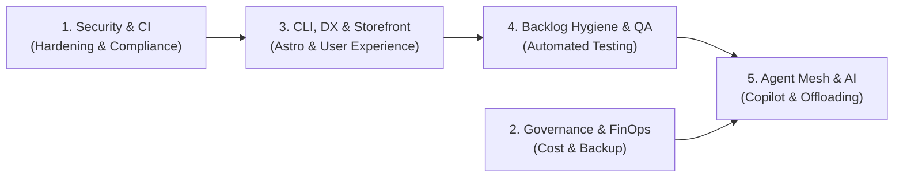

# 📋 Projekt-Changelog: ELBI & elbAI

Hier dokumentieren wir alle Neuerungen, Fehlerbehebungen, Performance-Optimierungen und Architektur-Entscheidungen für das **ELBI** E-Commerce-Ökosystem ([`elbi.de`](https://elbi.de)) und die Innovationsplattform **elbAI** ([`elbai.io`](https://elbai.io)).

---

## 🎯 Backlog & Architektur-Phasen (Statusübersicht)

Das Projekt wird strukturiert über das integrierte Backlog-System (`.agents/db/backlog.db`) und die folgenden 5 Entwicklungsphasen gesteuert:

- **Gesamtzahl erfasster Aufgaben:** 70
- **Erfolgreich abgeschlossen:** 54
- **In Vorbereitung / Geplant:** 16

---

## 🚀 Wichtige Meilensteine & Backlog-Tickets (September 2026)

### 1. Storefront, Branding & Didaktischer Feinschliff (v3)
- **Offizielles Elbi-Verlagslogo & neues Favicon**:
  - Einbindung des klassischen, hochauflösenden Original-Verlagslogos als gestochen scharfe Vektorgrafik (SVG) auf der Startseite und im Admin-Dashboard.
  - Neues Browser-Favicon: Rotes Elbi-„e“ in Maximalgröße mit prägnanter schwarzer Umrandung – perfekt lesbar und kontrastreich auf allen Geräten.
- **`AF-630` | Didaktische Lineaturkorrektur**:
  - Bereinigung der didaktischen Progression auf der Startseite und im CMS: Präzise Führung von 32 mm Großlineatur bis zur Standardlineatur der 4. Klasse.
- **Frontend-CMS für Shop-Texte (`AF-552`, `AF-553`, `AF-555`)**:
  - Sämtliche Texte (Hero, Vertrauenssignale, Stufensystem, Footer, Versandtexte) lassen sich im Admin-Bereich unter „Shop-Texte / CMS“ direkt bearbeiten und speichern.
  - Dynamisches Ankündigungsbanner mit 1-Klick-Aktivierung im Shop-Kopf.

### 2. Lagerbestand, PG-Verlag Synchronisation & Bestandsampel
- **`AF-597` & `AF-603` | PG-Lager Bestandsampel & Schwellenwerte**:
  - Rebranding der Spalte in der Admin-Produkttabelle zu **„PG Lager“**.
  - Dreistufige Ampel-Farbkodierung: Grün (> 50 Stück), Gelb (11–50 Stück, Warnung), Rot (<= 10 Stück, kritischer Tiefstand).
  - Schwellenwerte für Gelb und Rot sowie die Empfänger-E-Mail für automatische Lager-Alerts (`bestellung@elbi.de`) direkt unter „Einstellungen & Cache“ im Admin-Dashboard konfigurierbar.
- **Automatisierter PG-Lagerabgleich & Beseitigung alter Initialisierungs-Migrationen**:
  - Tägliche und ad-hoc Synchronisation der echten Bestände (18.780 Stück über 47 Katalogartikel) direkt in Cloudflare D1 (`elbi-store-eu`).
  - Restlose Entfernung veralteter Override-Migrationen (`stock = 100`) und dauerhafte Deaktivierung nächtlicher Demo-Resets für 100%ige Persistenz.

### 3. Rechtssicherheit, Versandkosten-Steuer & Bestellverwaltung
- **`AF-607` & `AF-585` | Steuerrechtliche Versandkostenberechnung als Nebenleistung**:
  - Gesetzlich exakte Mehrwertsteuer-Berechnung auf Versandkosten nach UStG (3,90 € Netto-Basis): 4,17 € brutto bei reinen 7%-Warenkörben (Bücher/Hefte), 4,64 € brutto bei reinen 19%-Warenkörben (Stempel/Zubehör) sowie proportionale Aufteilung bei Mischwarenkörben.
  - Transparente Aufschlüsselung im Warenkorb-Drawer und auf `/versand/`.
- **`AF-551` | Bestellverwaltung & Autonome Stornierungs-API**:
  - Bestellungen im Admin-Dashboard durchsuchbar, filterbar und GoBD-konform stornierbar.
  - Autonome B2B-Stornierungsschnittstelle für den Logistikpartner PG-Verlag.
- **Aktualisierung des Impressums (§ 5 DDG & § 18 MStV)**:
  - Hinterlegung der neuen Faxnummer (+49 (0) 8104 90840 15) und Bereinigung der Anschrift.

### 4. Qualitätssicherung & Test-Automatisierung (Autonomous Self-Verification)
- **`AF-520` | Headless Browser Self-Verification & Quality Gates**:
  - Playwright-basierte Testsuite (`scripts/verify-web.py`) für `elbai.io` und `elbi.de`.
  - Überprüft DOM-Rendering, Navigation, interaktive Komponenten (Diagramm-Lightbox, Zoom-Modals, Warenkorb-Drawer) und erzwingt **0 unhandled Console Errors** vor jedem Deployment.
- **`AF-547` | Mermaid Diagramm-Lightbox & Shadow DOM Interceptor**:
  - MkDocs Material Shadow DOM Interceptor in `extra.js` für gestochen scharfe Architektur-Diagramme im responsiven Vollbild-Modal mit Schließen-Funktion (`ESC`, Klick außerhalb, Close-Button).
- **`AF-558` | 1-Klick Cloudflare Cache-Purge**:
  - Integrierter Cache-Purge-Button im Admin-Dashboard zur sofortigen globalen Cache-Invalidierung (`purge_everything: true`).

### 5. CI/CD Stabilität, FinOps & GitHub Actions Härtung
- **`AF-550` | 20-Minuten-Timeout-Regel & CI Green State**:
  - Alle GitHub Workflows mit strikten `timeout-minutes: 20` und `concurrency: cancel-in-progress: true` gehärtet.
  - Vollständige Umstellung auf Node 24 Laufzeit und unveränderliche SHA-Hashes für alle Actions.
  - Bereinigung von Runner-OverlayFS-Checks in `pkg/tokens`.
- **`AF-525` | Rebrand & Clean Workspace: ai-factory**:
  - Sämtliche Pfade, Framework-Templates, Plugins, Binaries und Dokumentationen vollständig auf `ai-factory` bereinigt.

---

## 🔮 Geplante nächste Schritte (Auszug aus dem Backlog)

| Backlog-ID | Phase | Titel | Priorität |
| :--- | :--- | :--- | :--- |
| `AF-254` | `phase-1-security-ci` | Order Confirmation Email Delivery Investigation | **P1** |
| `AF-056` | `phase-1-security-ci` | Automated Security Gate, Self-Healing Dependency Bot & Scheduled Health Auditor | **P1** |
| `AF-114` | `phase-1-security-ci` | SAST Code Analysis: Semgrep & CodeQL Taint Tracking Pipeline | **P1** |
| `AF-128` | `phase-1-security-ci` | SCA & Supply Chain Defense: Trivy CLI & Automated Dependabot Remediation | **P1** |
| `AF-143` | `phase-1-security-ci` | Hardcoded Secrets Detection: Gitleaks Pre-Commit Hooks & Trufflehog CI Scans | **P1** |
| `AF-194` | `phase-2-governance-cost` | Differential & Change-Aware Backup Strategy for D1 and R2 Media | **P2** |
| `AF-213` | `phase-5-agent-mesh` | AI-Driven Support Assistant & Automated Customer Email Triage | **P2** |
| `AF-067` | `phase-3-cli-dx` | Reusable Cloudflare Edge E-Commerce Core & Commercial White-Label Scaffold | **P2** |
| `AF-233` | `phase-5-agent-mesh` | Educational B2B SaaS Solutions for Schools & Teachers | **P3** |

---

## 📅 Chronologische Versionshistorie

### Version 0.3.0 — 14.–15. September 2026
- `AF-597` / `AF-603`: PG-Lager Bestandsampel mit Farbkodierung (Grün/Gelb/Rot) und konfigurierbaren Schwellenwerten im Admin-Dashboard.
- `AF-607` / `AF-585`: Gesetzeskonforme Mehrwertsteuer-Berechnung der Versandkosten als Nebenleistung (3,90 € Netto-Basis, 4,17 € bzw. 4,64 € brutto).
- `AF-630`: Didaktische Korrektur der Lineaturführung auf 32 mm Großlineatur bis Klasse 4.
- `AF-558`: 1-Klick Cloudflare Edge Cache Purge Button im Admin-Dashboard.
- `AF-551`: Bestellungsübersicht & GoBD-Stornierungs-API für PG-Verlag Logistikpartner.
- `AF-552` / `AF-553`: Frontend-CMS für Shop-Texte und dynamisches Header-Ankündigungsbanner.
- `feat(inventory)`: PG-Lagerbestand synchronisiert (18.780 Stück über 47 Artikel), veraltete `stock = 100` Migrationen dauerhaft entfernt und Shop-Reset deaktiviert.
- `feat(branding)`: Original Elbi-Vektorlogo eingebunden, Favicon mit maximalem roten „e“ und schwarzer Umrandung geschärft.
- `fix(compliance)`: Impressum nach § 5 DDG mit neuer Faxnummer aktualisiert.

### Version 0.2.1 — 11.–12. September 2026
- `AF-550`: Strikte 20-Minuten-Timeouts und Concurrency-Cancelling für alle GitHub Workflows; Behebung von Runner-OverlayFS-Checks.
- `AF-547`: Shadow DOM Interceptor für Mermaid-Architekturdiagramme in MkDocs zur Behebung des Lightbox-Zoomfehlers.
- `AF-540`: Etablierung des Zero-Trust-Perimeters für `alpha.elbai.io` und `elbai.io/docs/`.
- `AF-525`: Rebranding von wiz-blitz zu ai-factory im gesamten Workspace.
- `AF-522`: Modernisierung des Doku-Layouts (Material Deep Purple, Dark Mode Toggle, vereinfachter Tester-Leitfaden).
- `AF-520`: Entkoppeltes AI-Copilot Widget mit Point-and-Click Inspector und Rollback-Zeitmaschine; Etablierung der autonomen Playwright Browser-Prüfung.
- `AF-488`: Startseiten-Bestseller mit progressivem Nachladen (Option C).
- `AF-458`: Continuous Deployment Invariante nach `dev.elbi.de` mit sofortigem Edge Cache Purge.
- `AF-429`: Admin MwSt. Dropdown Vereinheitlichung auf exakt 7% und 19%.
- `AF-401`: Ersatz des alten Schriftartenfilters durch das neue 4-Stufen Lernstufensystem.
- `AF-374`: Korrektur der Mehrwertsteuersätze nach Stammdaten-CSV in D1 und Storefront.

### Version 0.1.1 — 9.–10. September 2026
- `AF-035`: Storefront UX & Warenkorb-Persistenz im LocalStorage, Tastatur-Navigation (⌘K) und Worker Checkout.
- `AF-037`: Offizielles Elbi-Branding (Logo, Maskottchen, Kategorie-Banner, Schriften Outfit/Merriweather).
- `AF-039`: Impressum nach § 5 DDG und Kontaktseite für Schulanfragen.
- `AF-043`: Universeller Kauf auf Rechnung für alle Kundengruppen.
- `AF-044`–`AF-046`: Google Store Redesign (dynamischer Header, Sticky Buy Bar, aufgeräumte Weißräume).
- `AF-047`: E2E Katalog-Konsistenz- & EU-Datensouveränitäts-Audits (`ai-factory audit catalog`).
- `AF-061`: PG-Verlag Fulfillment- & Inventar-Schnittstelle.

### Version 0.1.0 — 8.–9. September 2026
- `AF-001`–`AF-006`: Initialer Aufbau von Astro 7 Storefront, Cloudflare D1/R2, Edge Workers API, OXID-Datenmigration (406 Produkte, 17.566 Kunden, 301-Redirects) und sicherer Passwort-Reset-Ablauf.
