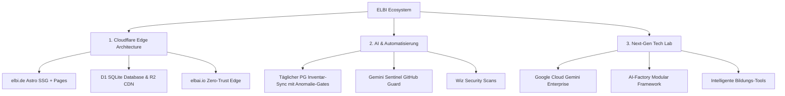

# elbAI // Living Documentation & Architecture

Willkommen in der lebenden Dokumentation von **elbAI.io** und **ELBI**.  
Hier dokumentieren wir alle technischen Meilensteine, Architektur-Entscheidungen, Edge-Deployments und KI-Automatisierungen.

> 💡 **Für Tester, Redakteure & das Team:**  
> 👉 [**📋 Zum Projekt-Changelog (Alle neuen Features, Fixes & Meilensteine)**](changelog.md)  
> 👉 [**Tester-Leitfaden für Testbetrieb & Versender**](operations/tester-guide-dad.md)  
> 👉 [**Alpha-Werkstatt & Zeitmaschine (Assistent)**](operations/alpha-timemachine-guide.md)

---

## 🎯 Die 3 Kernsäulen

### 1. Cloudflare Edge (`elbi.de` & `elbai.io`)
- **Moderne Webseiten auf Cloudflare:** Astro 7+ Zero-JS SSG mit reaktiven React 19 Islands.
- **Globales Edge-Netzwerk:** Sub-50ms TTFB weltweit, Auslieferung via Cloudflare Pages & Workers.
- **Kryptografische Sicherheit:** TLS 1.2+, HSTS Preload, Strict SSL, RFC-konformes Null-SPF und DMARC Reject.
- **Zero Trust Perimeter:** `alpha.elbai.io` und `elbai.io/docs` sind per Cloudflare Access mit Einmal-PIN/E-Mail-OTP geschützt.

### 2. Erste Automatisierungen mit AI
- **Täglicher Lagerbestand-Sync:** Automatisierter Abgleich aller Bestände aus dem PG-Verlag Kundenportal direkt in Cloudflare D1.
- **Anomalie- & Fail-Safe-Gates:** Verhindert falsche Bestandsdaten bei Ausfällen oder HTML-Änderungen.
- **Gemini Autonomous Guard:** KI-gestützte Triage von CI/CD-Fehlern und Security Alerts direkt in GitHub Actions.

### 3. Next-Gen Tech Lab
- Synergien zwischen **AI-Factory Framework** und modernen Cloud-APIs (Cloudflare Developer Platform & GCP Gemini Enterprise).
- Schrittweise Evolution vom reinen Webshop hin zum zukunftsweisenden Bildungs-Tech-Ökosystem.
