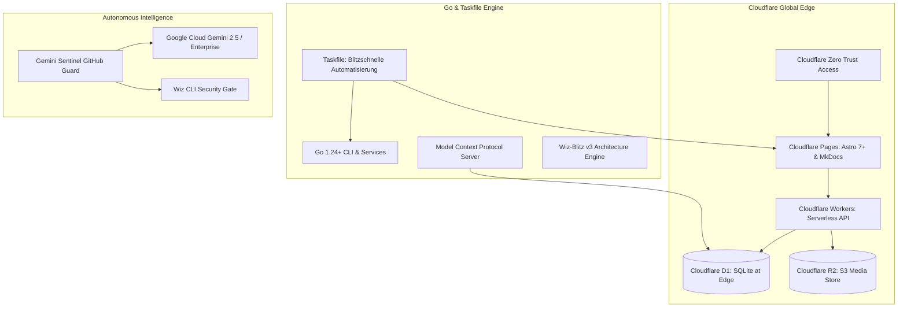

# Der moderne Tech-Stack: Cloudflare, Go & Astro 7+

Für **ELBI** und **elbAI.io** haben wir veraltete LAMP-Server und monolithische Architekturen vollständig abgelöst. Das gesamte System setzt ab sofort auf einen kompromisslos modernen, serverlosen und auditierbaren Technologie-Stack.

---

## Architektur-Matrix

---

## 1. Edge & Frontend Layer (Cloudflare & Astro)
- **Astro 7+ Zero-JS SSG:** Extrem schnelle Auslieferung purer HTML-Seiten für Produkte und Content. TTFB unter 50ms weltweit.
- **React 19 Islands:** Interaktive Komponenten (Warenkorb, Drawer, Filter) nur dort, wo Dynamik gebraucht wird.
- **Cloudflare Pages & Workers:** 100% Serverless, kein Betriebssystem-Patching, keine LAMP-Wartungskosten.
- **Cloudflare D1 & R2:** Georeplizierte SQLite-Datenbank direkt an der Edge mit S3-kompatiblem Medienspeicher ohne Egress-Kosten.
- **Cloudflare Zero Trust (Access):** Geschützte Staging-Bereiche (`dev.elbi.de`) und interne Dokumentationen (`/docs*`) ohne VPN-Zwang.

---

## 2. Tooling & Service Layer (Go & Taskfile)
- **Go als primäre Systemsprache:** Sämtliche CLI-Tools, Hintergrund-Services und MCP-Server werden in schnellem, typsicherem und CGo-freiem Go entwickelt.
- **Taskfile (`task`):** Ersetzt schwerfällige Makefiles durch ein standardisiertes, plattformübergreifendes YAML-Format.
- **Model Context Protocol (MCP):** Direkte Anbindung von Datenbanken, Cloudflare-Zonen und Scannern an KI-Agenten über standardisierte JSON-RPC Protokolle.

---

## 3. Autonomous AI & Security Layer (Gemini & Wiz)
- **Google Cloud Gemini Enterprise:** Hochentwickelte multimodale Modelle für Bildanalyse, Handschrift-Erkennung und Code-Triage.
- **Gemini Sentinel Guard:** Autonomer Bot in GitHub Actions, der fehlgeschlagene CI/CD-Pipelines analysiert und Fixes vorschlägt.
- **Wiz Security Gate:** Proaktives Scannen von IaC-Konfigurationen, Secrets und Containern vor jedem Release.
