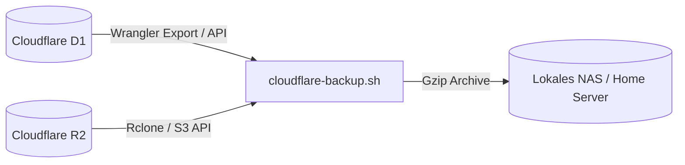

# Cloudflare D1 & R2 Automatisierte Backup-Strategie

Sicherung aller Cloudflare-Bestände auf lokaler Infrastruktur (NAS / Home Server) unabhängig von Cloud-Providern.

---

## 1. Backup-Architektur

- **Rhythmus:** Täglich 03:00 Uhr via System-Cron.
- **Inhalte:**
  - Kompletter D1 SQL Dump (`schema.sql` + Daten).
  - Delta-Sync aller in Cloudflare R2 gespeicherten Produktbilder.
- **Fail-Safe:** Versionierte Archive mit 30-Tage-Aufbewahrung.
