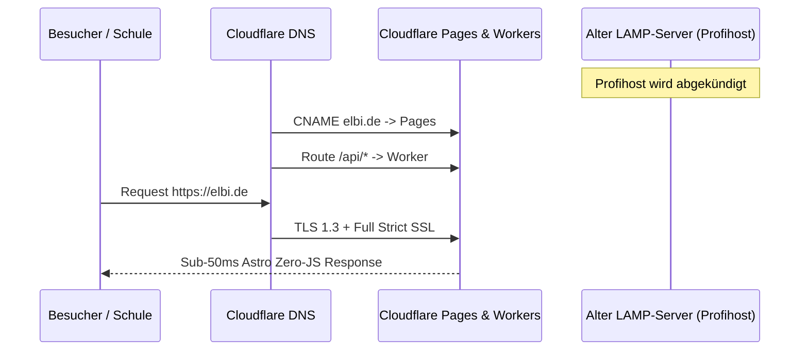

# ELBI Verlag – Go-Live Roadmap & Cutover-Plan

Dieser Leitfaden fasst die Schritte zusammen, die vor und während des produktiven Cutovers von `elbi.de` auf die neue Cloudflare Edge-Architektur durchgeführt werden.

---

## 1. Checkliste vor dem Go-Live (Pre-Cutover)

- [ ] **End-to-End Testlauf:**
  - Login im Admin-Portal (`https://dev.elbi.de/admin`).
  - Prüfung aller 47 Produkte, Bestände und Preise.
  - Vollständige Testbestellung im Frontend mit Versandnachweis-Druck (DIN A4 Lieferschein).
- [ ] **Produktiv-Secrets in Cloudflare Workers hinterlegen:**
  - `STRIPE_SECRET_KEY` & `STRIPE_WEBHOOK_SECRET` (Live-Modus).
  - `RESEND_API_KEY` für transaktionale E-Mails an Schulen.
  - `TURNSTILE_SITE_KEY` & `TURNSTILE_SECRET_KEY` für Bot-Schutz.
  - `ADMIN_PASSWORD` mit starkem Produktiv-Secret.
- [ ] **Letzter Datenabgleich (OXID Alt-Shop ➔ D1 SQLite):**
  - Delta-Export aus MySQL ziehen und in `elbi-prod-db` einspielen.
- [ ] **Automatisches Cloudflare-Backup einrichten:**
  - `local/cloudflare-backup.sh` per Cron-Job auf dem NAS/Home-Server aktivieren.

---

## 2. Der Go-Live Tag (Unterbrechungsfreier Cutover)

1. **Pages & Worker Live schalten:** `npx wrangler pages deploy dist --project-name elbi-storefront --branch main`.
2. **DNS Umstellung:** CNAMEs für `elbi.de` und `www.elbi.de` auf Cloudflare Pages schalten.
3. **Full Strict SSL:** Zertifikat auf "Full (Strict)" setzen.
4. **Cache Purge:** Vollständigen globalen Cache-Purge über die Cloudflare API ausführen.
5. **Profihost Legacy Kündigung:**
   - Kündigung alter Rest-Domains (`schreiblehrgänge.de`, `schwungübungsheft.de`, etc.).
   - Vollständige Kündigung des alten LAMP-Servers bei Profihost ("Bye LAMP, Hello Serverless!").
